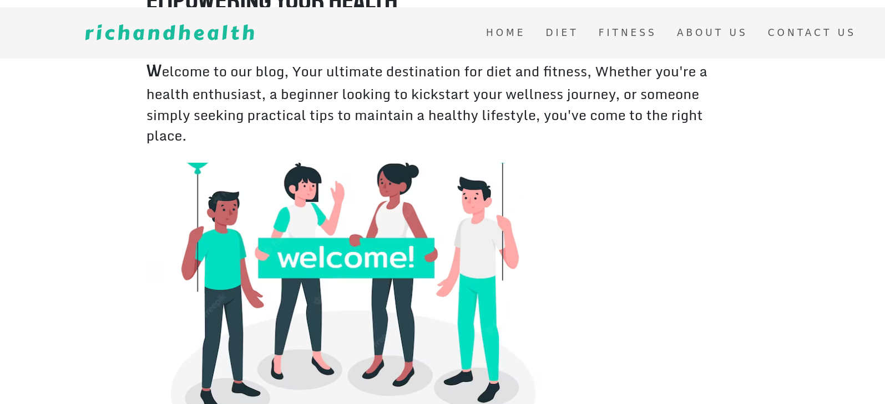

## Table of Contents
* [Project Info](#richandhealth)
* [Technologies](#technologies)
* [Requirement](#requirement)
* [Installation](#installation)
* [Setup](#setup)


# richandhealth
richandhealth is a blog that about empowering individuals on their journey towards holistic wellness.
We understand that true well-being encompasses more than just diet and fitness – it's about nurturing your mind, body, and spirit.
Our mission goes beyond simply providing diet and fitness advice. We strive to be your trusted companion, guiding you towards a healthier and happier lifestyle.
With a deep-rooted belief in the transformative power of self-care, we aim to provide you with the knowledge, resources, and motivation
to make positive changes in all aspects of your life.We believe that small,consistent steps can lead to significant transformations, and we are here to help you navigate that journey.



## Technologies
Project is created with:
* Javascript
* CSS(Cascading Style Sheets)
* EJS(Embedded JavaScript templates)

## Requirement
* Node.js
* Npm
* Git
* Browser

## Installation
### Node installation on Windows

  Just go on [official Node.js website](https://nodejs.org/) and download the installer.
Also, be sure to have `git` available in your PATH, `npm` might need it (You can find git [here](https://git-scm.com/)).

### Node installation on Ubuntu/Debian

  You can install nodejs and npm easily with apt install, just run the following commands.
      ```
      $ sudo apt install nodejs
      $ sudo apt install npm
      ```
### Other Operating Systems
  You can find more information about the installation on the [official Node.js website](https://nodejs.org/) and the [official NPM website](https://npmjs.org/).

If the installation was successful, you should be able to run the following command.

    ```
    $ node --version
    v8.11.3

    $ npm --version
    6.1.0
    ```
If you need to update `npm`, Just run the following command in the Terminal
    ```
    $ npm install npm -g
    ```
## Setup
To run this project clone the repository and use `node` 
    ```
    
    $ git clone git@github.com:polyhistor2050/richandhealth.git
    $ cd richandhealth
    $ node app.js
    
    ```
the server will respond with a message
  ```
  server is started on port 3000
  ```
On your browser type
  ```
  localhost:3000
  ```
